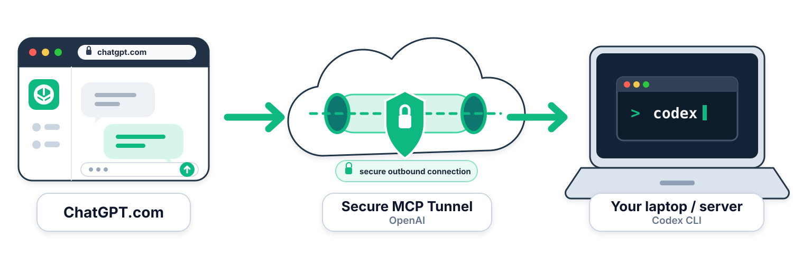

# ChatGPT Local Codex Tunnel



Run Codex on your Mac from ChatGPT through OpenAI Secure MCP Tunnel.

This is an unofficial local bridge. It keeps the MCP backend private and opens only outbound HTTPS through OpenAI's official `tunnel-client`.

## Watch it working

Want to see ChatGPT reaching your Mac? In another terminal, follow the shared tunnel/adapter log:

```bash
tail -f "$HOME/Library/Application Support/tunnel-client/logs/local-codex.log"
```

Requests and adapter events appear here as ChatGPT uses Local Codex. See [Monitor from the Mac](#monitor-from-the-mac) for filtering, event details, and health checks.

## What it exposes

- `codex(requestId, cwd, prompt, networkAccess?, model?, reasoningEffort?)` starts a background job in any existing folder.
- `codex-reply(requestId, threadId, prompt, networkAccess?, model?, reasoningEffort?)` starts a background reply on an adapter-owned thread.
- `codex-status(jobId, waitMs?)` reads progress and the saved result. Use `waitMs: 20000` while running.
- `codex-cancel(jobId)` explicitly stops work. It does not undo file changes.
- `codex-folders(path?, cursor?)` lists up to 100 child directory names per page. It defaults to your home directory and never reads file contents.

ChatGPT chooses an existing absolute `cwd` for each new thread, with **no directory allowlist or per-folder approval**. It can use `codex-folders` to locate the narrowest folder relevant to your task. Symlinks resolve to their target; the canonical `cwd` is returned with the job and is its write boundary. Relative, missing, inaccessible, and file paths fail without starting work. Folder discovery includes directory symlinks but omits files and broken links; follow `nextCursor` with the same path to continue the alphabetical listing.

Replies always use their thread's saved folder and cannot accept a different `cwd`. Start a new thread to change folders. If a saved folder disappears or resolves elsewhere, replies fail without widening access. The caller cannot change the sandbox or permission level.

New jobs default to **gpt-5.6-luna / max**. Optional model IDs or aliases (`luna`, `terra`, `sol`) and reasoning levels are checked against Codex's model catalog. Unsupported combinations fail without fallback. Replies inherit the thread's last settings unless overridden.

Command network access is also thread-scoped. New threads default to **disabled**. ChatGPT chooses the setting from the task: requests that inherently need outbound access—such as `git fetch`, `git clone`, installing dependencies, `curl`, API calls, or downloads—should automatically opt in even when the user does not mention network access. Fully local work stays disabled. Replies inherit the thread's last setting when omitted, and an explicit reply value persists for later replies. The adapter uses Codex's native permission profile and does not proxy individual commands.

### Background job flow (v2)

1. Choose `cwd`, generate a unique `requestId`, and submit once. The response contains a `jobId` and canonical `cwd`, not the answer.
2. Poll `codex-status` until `completed`, `failed`, `cancelled`, `timed_out`, or `interrupted`. Only `completed` contains a successful final answer.
3. If submission delivery is uncertain, retry with the **same requestId and arguments**. This returns the same saved job. Reusing an ID with different arguments or a different canonical folder fails.

There is one active job and **no waiting queue**. A `busy` response contains `activeJobId`; it does not accept or queue the new request. Status checks never start work. Closing a status request or its connection does not cancel an accepted job; use `codex-cancel` explicitly.

Jobs run independently of the tunnel's response deadline, with a 30-minute execution limit by default. Set `LOCAL_CODEX_CALL_TIMEOUT_MS` in the local config to change it. Cancellation first requests `turn/interrupt`, then terminates the job's process group if needed. A new job is not admitted until the old process has exited.

Job metadata and final results are saved atomically under `LOCAL_CODEX_JOBS_DIR` (default: `jobs` next to `threads.json`), using mode `0700` directories and `0600` files. Request IDs and input fingerprints are hashed; job files do not contain prompts or reasoning. Codex's own session history is separate and may contain the original input. Saved results are retained until explicitly removed. On adapter restart, unfinished jobs become `interrupted` and are never replayed; inspect their threads before starting replacement work.

## Security boundary

- The adapter listens only on `127.0.0.1`.
- A generated bearer token protects the local MCP endpoint.
- Each Codex job receives system read access and write access only to its chosen canonical folder. On macOS, other user folders, mounted volumes, and temporary trees are denied unless they are inside the chosen folder.
- The macOS profile deliberately avoids Codex 0.147's `:minimal` preset, which grants unconditional system-temp writes. Tools that need writable scratch space must use the chosen folder.
- `.codex` stays read-only. `.git` is writable inside the selected folder because fetch, clone, commit, and related Git operations require metadata writes.
- Common credential files inside every selected folder are denied to sandboxed commands: `.env`, `.env.*`, `*.env`, `.npmrc`, and `.pypirc`, including nested copies.
- The authenticated folder lookup tool can list directory names elsewhere; it does not grant the running job access to those folders.
- Commands run without network access by default. `networkAccess: true` enables broad direct command network access without a domain allowlist. A network-enabled job can send readable workspace or system data to external services, so enable it only for tasks and folders you trust.
- The hardened Codex wrapper gives app-server a small environment allowlist and enables secret-name filtering for command subprocesses. Ambient API keys, database URLs, adapter/tunnel variables, passwords, authentication values, cookies, and sessions are not forwarded.
- Thread replies are accepted only for thread IDs created by this adapter.
- No inbound public port is required.

The adapter uses `codex app-server`, which OpenAI recommends in place of the deprecated `codex mcp-server` command.

These controls reduce accidental credential exposure; they do not make arbitrary selected-folder contents non-sensitive. See [SECURITY.md](SECURITY.md) for the threat model and vulnerability-reporting guidance.

## Requirements

- macOS
- Node.js 22 or newer
- Codex CLI 0.138.0 or newer, logged in; latest stable is recommended because permission profiles are beta
- Official OpenAI `tunnel-client`
- An OpenAI tunnel ID associated with your Platform organization and ChatGPT workspace
- A runtime API key with **Tunnels Read + Use**, stored in a local file
- ChatGPT developer mode

Official setup references:

- [Secure MCP Tunnel](https://developers.openai.com/api/docs/guides/secure-mcp-tunnels)
- [Codex app server](https://learn.chatgpt.com/docs/app-server)
- [Codex permissions](https://learn.chatgpt.com/docs/permissions)

## Provision the OpenAI tunnel

Do this once before installing the local bridge:

1. In the target OpenAI Platform organization, make sure you have **Tunnels Read + Manage** to create or edit a tunnel. Running `tunnel-client` and selecting the tunnel while creating the ChatGPT app require **Tunnels Read + Use**. ChatGPT developer mode is a separate workspace permission.
2. Open [OpenAI Platform → Tunnels](https://platform.openai.com/settings/organization/tunnels), create a tunnel, and copy its `tunnel_...` ID.
3. Associate the tunnel with both:
   - the Platform organization that owns or manages it; and
   - the ChatGPT workspace where you will create the **Local Codex** app.
4. Create or use a runtime API key for a principal with **Tunnels Read + Use**. Store the key in a local file outside the repository and restrict the file to your user, for example:

   ```bash
   chmod 600 /absolute/path/to/runtime-api-key
   ```

5. Keep the tunnel ID and runtime-key file path handy for the installer below.

The end-to-end sequence is:

```text
Create tunnel → associate ChatGPT workspace → create runtime key → install → start → connect in ChatGPT
```

If the tunnel does not appear when you create the ChatGPT app, first check the ChatGPT workspace association and that the app creator has **Tunnels Read + Use**. `tunnel-client` only needs outbound HTTPS to OpenAI; this project does not require a public inbound port.

## Install

Clone the repository, then run:

```bash
./scripts/install.sh \
  --tunnel-id tunnel_... \
  --runtime-api-key-file /absolute/path/to/runtime-api-key
```

The installer:

- installs the launcher at `~/.local/bin/local-codex-tunnel`;
- installs the adapter and hardened Codex wrapper under `~/.local/libexec`;
- generates a mode-`0600` local bearer token;
- writes private local configuration under `~/Library/Application Support/local-codex-tunnel`;
- writes `~/.config/tunnel-client/local-codex.yaml` without copying or printing the API key.

Preview paths and validation without changing anything:

```bash
./scripts/install.sh \
  --tunnel-id tunnel_... \
  --runtime-api-key-file /absolute/path/to/runtime-api-key \
  --dry-run
```

## Start

```bash
~/.local/bin/local-codex-tunnel
```

Keep that terminal open while using Local Codex in ChatGPT.

## Connect in ChatGPT

1. Open **Plugins** and choose **Create app**.
2. Name it **Local Codex**.
3. Select **Tunnel** under Connection.
4. Select your tunnel and choose **No Auth**.
5. Accept the custom MCP warning and connect the app.

Test it with:

```text
Use Local Codex's codex-folders tool to find the relevant project folder. Call codex with its absolute cwd, requestId: smoke-001, and prompt: Reply with exactly TEST_OK. Then poll codex-status for the returned jobId using waitMs: 20000 until it completes. Do not submit the prompt again with a new requestId.
```

Normal network-dependent prompts do not need permission boilerplate. For example:

```text
Use Local Codex in /path/to/project to fetch PR #123 and run its tests.

Use Local Codex in /private/tmp/local-codex-intent-e2e to curl https://github.com and report the first HTTP status line. Do not modify files.
```

Purely local prompts keep command networking disabled:

```text
Use Local Codex in /path/to/project to run the tests from the current checkout without fetching or installing anything.
```

After upgrading from v1, refresh Local Codex's tool definitions in ChatGPT (or reconnect the app if needed). v2 requires `requestId` and changes submission responses from final answers to job handles. A cached v1 call without `requestId` is rejected without starting work.

v3 additionally requires `cwd` for `codex` and adds `codex-folders`. Refresh tools after upgrading from v2; cached submissions without `cwd` are rejected with a clear error. Existing jobs and threads are migrated to their original folder using the old `LOCAL_CODEX_ROOT`. Their results and request fingerprints are preserved. The migration source is saved once in thread state, so later configuration changes cannot retarget old threads. `LOCAL_CODEX_ROOT` (and the installer's optional `--root`) is only a legacy migration input, not a default or limit for new jobs. Keep it set until legacy records have been migrated; fresh installations do not need it.

v3.1 adds optional `networkAccess` to `codex` and `codex-reply`. Existing callers remain network-disabled, legacy threads migrate with network disabled, and saved request fingerprints remain valid when the field was omitted. Refresh Local Codex's tools and start a fresh conversation before using the new option.

v3.1.1 clarifies the MCP contract so ChatGPT chooses `networkAccess` from the user's task intent. Runtime defaults and sandbox behavior are unchanged. Refresh Local Codex's tools and use a fresh conversation so ChatGPT receives the new descriptions.

### If ChatGPT reports missing `requestId` or `cwd`

Missing required submission fields return `schema_outdated`, the adapter version, and its `schemaFingerprint`. No job is started. In ChatGPT, open **Local Codex → Manage → Refresh**, then use a **fresh conversation**. Existing conversations can retain older tool definitions even when the connection's settings show the new schema. Do not work around this by dropping required fields, inventing a working directory, or retrying with new IDs.

The adapter's `/readyz` response includes the same fingerprint. Safe `schema_served` and `call_rejected` log events identify which schema was served and why a request was rejected, without logging caller IDs, prompts, or argument values. The static plugin description/version in ChatGPT is separate from the live tool schema; inspect its **Actions → Input schema** to verify `requestId`, `cwd`, and `networkAccess`.

Treat a successful no-file-changes job submitted and polled from ChatGPT as the end-to-end check. A healthy local endpoint alone does not prove that ChatGPT has the updated tools.

For an existing installation, stop new work and wait for the active job to finish. Back up the adapter, wrapper, launcher, config, token, tunnel profile, jobs, and thread history. Upgrade the adapter, wrapper, and launcher together; keep the existing private state and tunnel credentials. Ensure `LOCAL_CODEX_BIN` points to the installed wrapper and `LOCAL_CODEX_REAL_BIN` points to `codex`, then restart and refresh ChatGPT's tools.

## Monitor from the Mac

Follow tunnel traffic:

```bash
tail -f "$HOME/Library/Application Support/tunnel-client/logs/local-codex.log"
```

Check health and readiness:

```bash
base=$(<"$HOME/Library/Application Support/tunnel-client/health/local-codex.url")
curl -s "$base/healthz"; echo
curl -s "$base/readyz"; echo
```

List Codex threads created by ChatGPT:

```bash
jq -r '.threadIds[]' "$HOME/Library/Application Support/local-codex-tunnel/threads.json"
```

Open Codex history, including app-server sessions:

```bash
cd /path/to/chosen/project
codex resume --all --include-non-interactive
```

## Development

```bash
npm test
npm run check
# Optional macOS boundary checks using the installed Codex CLI (no model calls):
LOCAL_CODEX_NATIVE_TEST=1 npm test
```

Tests use fake Codex processes, temporary state, and loopback HTTP. They cover per-job folders, directory pagination, symlinks, legacy migration, replies after restart, retries, busy handling, cancellation, timeout, model and network settings, credential denies, wrapper environment filtering, permissions, and private logging. They do not require OpenAI or GitHub credentials.

## License

MIT
